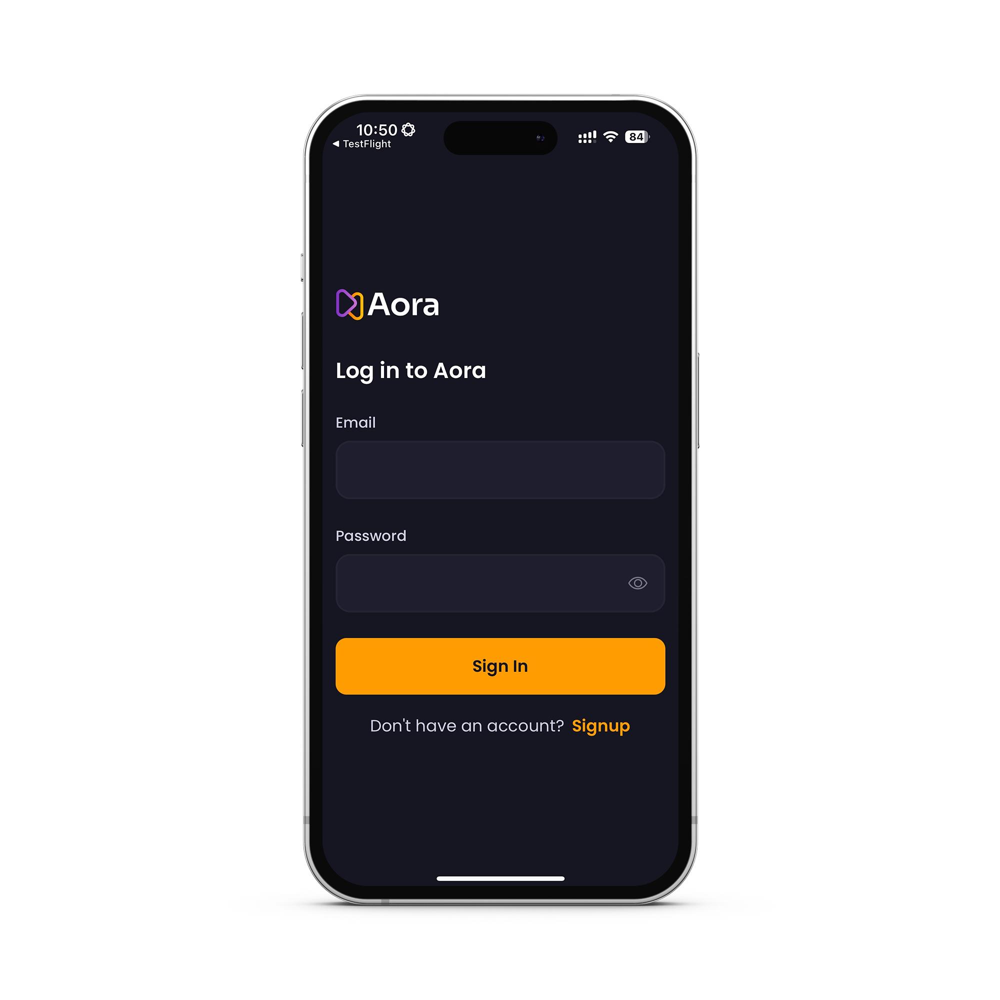

# GradWellbeing – Aora App  
> **Well-being of Graduate Students with AI-Based Monitoring**

GradWellbeing (Aora) is a mobile app designed to monitor and support the well-being of graduate students using the **Job Demands–Resources (JD-R) model** and AI-driven analysis.  
The app collects self-reports and digital interaction data to help students and their advisors track stress levels, resources, and overall well-being.

---

## ✨ Features
- **Secure Sign-Up & Login**  
  Email-based authentication with Firebase, including institutional email support.

- **Daily Tasks & Questionnaires**  
  Automatic task scheduling and JD-R model–based questionnaires to assess perceived stress, peer support, supervision, infrastructure, and intellectual climate.

- **Data Upload & Sync**  
  Upload daily schedules, video call transcripts, and sync email/chat/calendar data through Microsoft Graph.

- **AI-Based Analysis**  
  Backend scripts process collected data and simulate JD-R scores to monitor well-being over time.

---

## 📸 Screenshots
| Welcome | Login | Questionnaire |
|---------|------|----------------|
|  |  |  |

| Sign-Up (1) | Sign-Up (2) | Sync |
|-------------|-------------|-----|
|  |  |  |

> Add or update the image paths (`./assets/screenshots/...`) to match your repository structure.

---

## 🛠 Tech Stack
- **Frontend**: [React Native](https://reactnative.dev/) with Expo Router, Tailwind styling
- **Backend / Database**: Firebase Authentication & Firestore
- **Integrations**: Microsoft Graph API (Teams chats, Outlook emails, calendar)
- **AI/ML**: LLM-based JD-R simulation pipeline (Python)

---

## 🚀 Getting Started
### Prerequisites
- Node.js & npm
- Expo CLI
- Firebase project credentials
- Microsoft Azure app registration (for Graph API)

### Installation
```bash
# Clone the repository
git clone https://github.com/<your-username>/<repo-name>.git
cd <repo-name>

# Install dependencies
npm install

# Start the Expo development server
npx expo start
