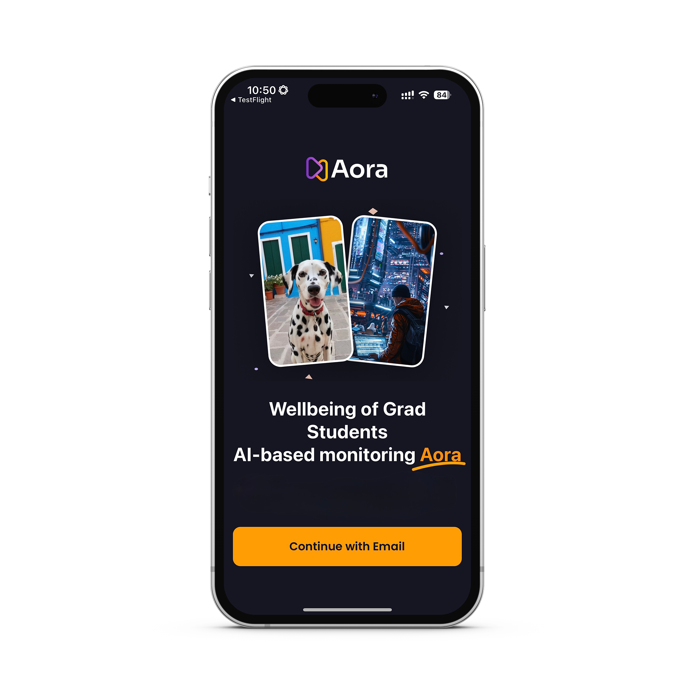

# GradWellbeing – App  
> **Well-being of Graduate Students with AI-Based Monitoring**

GradWellbeing is a mobile application designed as a data-collection tool to study graduate student well-being.
The app securely gathers self-reported JD-R questionnaire responses along with selected occupational digital interaction data (chat, email, calendar). These datasets power our [**JDR-LLM**](https://github.com/saferi1023/JDR-LLM) research, where we apply large-language-model analysis to simulate JD-R scores and investigate graduate student well-being patterns.

---

## ✨ Key Features
- **Secure Authentication**  
  Email-based sign-in and institutional login (Microsoft / Azure) for protected data access.

- **JD-R Model Questionnaire**  
  5-point Likert-scale questions to assess perceived stress, peer support, supervision, infrastructure, and intellectual climate.

- **Daily Sync & Data Retrieval**  
  Retrieve occupational digital data (chat messages, emails, and calendar schedules) directly using Microsoft Graph API.

- **File Uploads**  
  Upload schedule or transcript files with custom date selection for AI processing.

- **AI-Based Insights**  
  Collected data is processed by a Python/LLM pipeline to estimate weekly JD-R scores.


---

## 📸 Screenshots
| Welcome | Login | Questionnaire |
|---------|------|----------------|
|  |  |  |

| Sign-Up (1) | Sign-Up (2) | Sync |
|-------------|-------------|-----|
|  |  |  |

---


## 📱 Key App Tabs

### 1️⃣ Questionnaire Tab
Students can fill out and submit a **JD-R based questionnaire** consisting of **5 categories** (Perceived Stress, Peer Support, Supervision, Infrastructure, Intellectual Climate) with a **total of 26 Likert-scale questions**.  
Upon completion, all responses are securely stored in **Firestore Cloud** for later analysis.


---

### 2️⃣ Sync Tab
Through the **Sync** tab, students can:
- Securely log in using their **institutional ID** via Microsoft authentication.
- Retrieve and upload:
  1. **Chat messages** with their advisor  
  2. **Emails**  
  3. **Calendar schedules**

This process allows fine-grained, privacy-aware syncing of academic interaction data.

| Sync Main | Login | Sync After Login |
|------|-----------|------------------|
|  |  |  |

---

### 3️⃣ Upload Tab
Students can also report **additional documents** (e.g., schedules or transcript files) through the **Upload** tab.  
Users select the file type, assign a date, and upload the document, which is then securely stored in Firestore for research analysis.


---

## 🛠 Tech Stack
- **Frontend**: [React Native](https://reactnative.dev/) with Expo Router, Tailwind styling
- **Backend / Database**: Firebase Authentication & Firestore
- **Integrations**: Microsoft Graph API (Teams chats, Outlook emails, calendar)
- **AI/ML**: LLM-based JD-R simulation pipeline (Python)

---

## 🚀 Getting Started
### Prerequisites
- Node.js & npm
- Expo CLI
- Firebase project credentials
- Microsoft Azure app registration (for Graph API)

### Installation
```bash
# Clone the repository
git clone https://github.com/<your-username>/<repo-name>.git
cd <repo-name>

# Install dependencies
npm install

# Start the Expo development server
npx expo start
